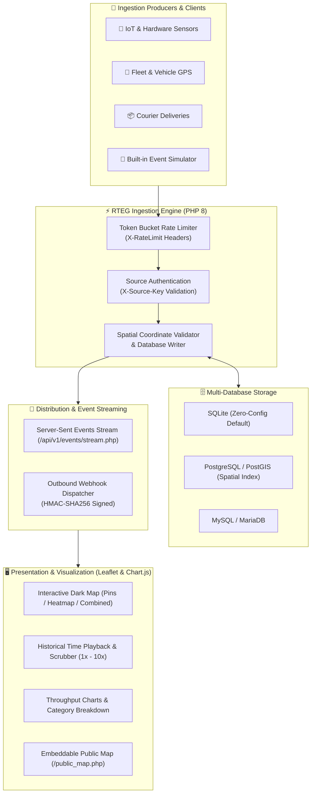

# 📡 Realtime Map Event Grid (RTEG)

<div align="center">

[](https://php.net/)
[](https://sqlite.org/)
[](https://postgresql.org/)
[](https://mysql.com/)
[](https://docker.com/)
[](LICENSE)
[](tests/test_rteg.php)
[](https://github.com/adacreativeco/realtime-map-event-grid/stargazers)
[](https://github.com/adacreativeco/realtime-map-event-grid/releases)

<br/>

**High-Performance Spatial Event Ingestion, Real-Time Streaming & Geospatial Heatmap Visualization Engine.**

[English Documentation](README.md) • [🇹🇷 Türkçe Dokümantasyon](README.tr.md) • [📖 Case Study](https://adacreative.co/vaka-analizleri/realtime-map-event-grid)

</div>

---

**Realtime Map Event Grid (RTEG)** is an ultra-lightweight, high-throughput spatial event ingestion, processing, and visualization platform. It ingests geo-located events from external IoT sensors, fleet trackers, delivery networks, and mobile clients via REST APIs, stores them across SQLite, PostgreSQL/PostGIS, or MySQL databases, streams them in real-time via **Server-Sent Events (SSE)**, and renders them on an ultra-sleek dark Leaflet map with density heatmaps.

Built with **pure Vanilla PHP 8** and modern vanilla JavaScript, offering enterprise-grade speed with **zero framework overhead**.

---

## 🏗️ System Architecture



---

## 🚀 Key Features

### 1. ⚡ Zero-Latency Live Streaming (SSE)
- Native Server-Sent Events push channel (`/api/v1/events/stream.php`) broadcasting spatial events instantly with zero websocket handshake overhead.
- Automatic 3-second intelligent polling fallback for legacy environments.

### 2. 🔥 Dynamic Heatmap & Layer Modes
- 📍 **Pins Mode:** Color-coded markers with glowing pulse animations categorized by event type.
- 🔥 **Heatmap Mode:** Real-time density gradient mapping spatial event clusters and high-traffic hot zones.
- ✨ **Combined Mode:** Overlay markers and heatmap density simultaneously.

### 3. ⏱️ Historical Time Scrubber & Map Replay
- Interactive playback controller allowing operators to rewind, scrub, and replay historical events across time with variable speeds (`1x`, `2x`, `5x`, `10x`).

### 4. 🗄️ Multi-Database Architecture
- **SQLite:** Default zero-config file DB for instant local setup.
- **PostgreSQL / PostGIS:** Enterprise spatial indexing (`idx_events_coords`, `idx_events_ts`).
- **MySQL / MariaDB:** High-throughput relational storage with InnoDB indexing.

### 5. 🚦 Token Bucket Rate Limiting
- Source-level rate throttling protecting ingestion endpoints from flood attacks with standard RFC headers: `X-RateLimit-Limit`, `X-RateLimit-Remaining`, `X-RateLimit-Reset`, and `Retry-After`.

### 6. 🔍 Multi-Dimensional Spatial Filtering
- **Bounding Box (`bounds`):** Restricts queried events strictly to the visible map viewport.
- **Full-Text JSON Payload Search:** Instant filtering within payloads, categories, and event IDs.
- **Category & Source Multi-Select:** Filter between fleets, sensor alerts, and deliveries.

### 7. 🔔 Outbound Webhooks & Security
- Background dispatcher queue (`scripts/dispatch_webhooks.php`) with cryptographic **HMAC-SHA256** payload verification headers.

---

## 📡 API Endpoints Reference

| Endpoint | Method | Authentication | Description |
|---|---|---|---|
| `/api/v1/event/ingest.php` | `POST` | `X-Source-Key` | Ingests a new spatial event with lat, lon, timestamp, type, and JSON payload. |
| `/api/v1/events/stream.php` | `GET` | None | Server-Sent Events (SSE) live push stream. |
| `/api/v1/events.php` | `GET` | Optional | Queries events with bounding box, category, limit, and time filters. |
| `/api/v1/stats.php` | `GET` | Optional | Returns 24h event volumes, category breakdown, and throughput metrics. |
| `/api/v1/simulator.php` | `POST` | Admin Session | Generates moving vehicle GPS tracks, courier dispatches, and sensor alerts. |

### 📝 Sample Event Ingestion (cURL)

```bash
curl -X POST http://localhost:8081/api/v1/event/ingest.php \
  -H "Content-Type: application/json" \
  -H "X-Source-Key: test_key" \
  -d '{
    "type": "vehicle_movement",
    "lat": 41.0082,
    "lon": 28.9784,
    "timestamp": 1724250000,
    "payload": {
      "vehicle_id": "CAR-042",
      "speed_kmh": 72.4,
      "fuel_level": 84
    }
  }'
```

---

## 🛠️ Quick Start

### Option A: Docker Compose (Recommended)
```bash
git clone https://github.com/adacreativeco/realtime-map-event-grid.git
cd realtime-map-event-grid
docker-compose up -d
```
Open [http://localhost:8081](http://localhost:8081) in your browser. (Default credentials: `admin` / `admin123`).

### Option B: Standalone PHP Built-in Server
```bash
# 1. Initialize Database
php database/init.php

# 2. Run Automated Unit Tests
php tests/test_rteg.php

# 3. Start Local Server
php -S 0.0.0.0:8081 -t public/
```
Open [http://localhost:8081](http://localhost:8081).

---

## 📂 Project Structure

```
realtime-map-event-grid/
├── config/
│   ├── credentials.php             # Database credentials & source keys
│   └── settings.php                # Global app settings & rate limits
├── database/
│   ├── events.db                   # Default SQLite database file
│   └── init.php                    # Multi-database schema migration script
├── public/                         # Web root & public assets
│   ├── index.php                   # Main dashboard (Leaflet map & event stream)
│   ├── public_map.php              # Embeddable public map
│   ├── stats.php                   # Analytics dashboard & Chart.js visualizations
│   ├── sources.php                 # API source key management panel
│   ├── api_docs.php                # Interactive API documentation
│   ├── api/v1/                     # REST API endpoints (ingest, stream, stats, simulator)
│   └── assets/                     # CSS stylesheets & vanilla JS controllers
├── src/                            # Core PHP backend classes
│   ├── Auth.php                    # Session authentication & security
│   ├── Database.php                # PDO connection pool (SQLite/PostgreSQL/MySQL)
│   ├── EventManager.php            # Ingestion, validation & spatial queries
│   ├── RateLimiter.php             # Token bucket rate limiting engine
│   ├── Webhook.php                 # Outbound webhook queue & HMAC signing
│   └── Logger.php                  # Ingestion access & error logging
├── scripts/
│   ├── cleanup.php                 # Retention cleanup cron script
│   └── dispatch_webhooks.php       # Background webhook queue dispatcher
├── tests/
│   └── test_rteg.php               # Automated test suite (19 unit tests)
├── Dockerfile                      # Production PHP-Apache container
└── docker-compose.yml              # Multi-container setup
```

---

## 📄 License

Distributed under the Apache 2.0 License. See [LICENSE](LICENSE) for details.

---

<div align="center">
Built with 📡 by <a href="https://github.com/adacreativeco">ADA Creative Co.</a>
</div>
