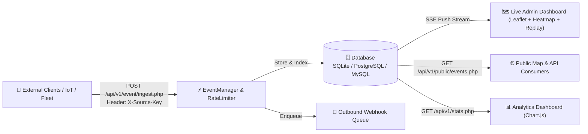

# 📡 Realtime Map Event Grid (RTEG)

<p align="center">
  <a href="https://php.net/"></a>
  <a href="https://www.postgresql.org/"></a>
  <a href="https://www.mysql.com/"></a>
  <a href="https://www.sqlite.org/"></a>
  <a href="https://docker.com"></a>
  <a href="LICENSE"></a>
</p>

<p align="center">
  <b>High-Performance Spatial Event Ingestion & Realtime Visualization Engine</b><br>
  <i>Ultra-lightweight, zero-dependency PHP 8 core with Server-Sent Events (SSE), Heatmap layers, and historical time replay.</i>
</p>

<p align="center">
  <a href="README.md"><b>English 🇬🇧</b></a> •
  <a href="README.tr.md"><b>Türkçe 🇹🇷</b></a>
</p>

---

## 🎯 Overview

**Realtime Map Event Grid (RTEG)** is a lightweight, high-throughput spatial event ingestion, processing, and visualization platform. It collects geo-located events from external IoT sensors, fleet trackers, delivery networks, mobile clients, and security monitoring systems via REST APIs, stores them across SQLite, PostgreSQL/PostGIS, or MySQL databases, streams them in real-time using Server-Sent Events (SSE), and renders them on an ultra-sleek dark Leaflet map with density heatmaps.

Built with pure Vanilla PHP 8 and modern vanilla JavaScript, offering enterprise-grade speed without framework bloat.

---

## ✨ Key Features

* **⚡ Zero-Latency Live Streaming (SSE):** Native Server-Sent Events push channel for instant event broadcasting with an automatic 3-second smart polling fallback.
* **🔥 Dynamic Heatmap & Layer Modes:**
  * 📍 **Pins Mode:** Color-coded markers with glowing pulse animations by category.
  * 🔥 **Heatmap Mode:** Real-time density gradient showing spatial event concentration.
  * ✨ **Combined Mode:** Overlay markers and heatmap density simultaneously.
* **⏱️ Historical Time Scrubber & Map Replay:** Interactive playback controller to rewind, scrub, and replay historical events across time with variable speeds (1x, 2x, 5x, 10x).
* **🗄️ Multi-Database Architecture:** Seamless plug-and-play support for **SQLite** (zero-config file DB), **PostgreSQL / PostGIS** (enterprise spatial querying), and **MySQL / MariaDB**.
* **🚦 Token Bucket Rate Limiting:** Per-source request throttling with standard `X-RateLimit-Limit`, `X-RateLimit-Remaining`, `X-RateLimit-Reset`, and `Retry-After` headers (HTTP 429 protection).
* **🔍 Multi-Dimensional Spatial Filtering:**
  * **Bounding Box:** Filter events strictly within the visible map viewport.
  * **JSON Full-Text Search:** Search instantly within event IDs, categories, and JSON payloads.
  * **Source & Category:** Multi-select dropdown filters.
* **🎲 Built-in Event Simulator:** On-demand generator for realistic vehicle movements, courier deliveries, sensor alerts, and temperature spikes.
* **📊 Analytics Dashboard (Chart.js):** 24-hour hourly trend line charts, category doughnut distributions, and top API client rankings.
* **🔑 API Source Management:** Dynamic generation and status toggling of `X-Source-Key` credentials.
* **🔔 Outbound Webhooks:** Background dispatcher queue with HMAC-SHA256 payload signatures.
* **🌐 Full Bilingual Support (i18n):** Instant TR / EN language toggle across all dashboards, modals, charts, and public maps without page reloads.

---

## 🏗️ Architecture & Data Flow



---

## 🚀 Quick Start

### Option A: 🐳 1-Click Run with Docker (Recommended)

```bash
git clone https://github.com/adacreativeco/realtime-map-event-grid.git
cd realtime-map-event-grid

# Start the application in detached mode
docker compose up -d
```
The application will be live immediately at `http://localhost:8081`!

---

### Option B: Run Locally with PHP Built-in Server

```bash
git clone https://github.com/adacreativeco/realtime-map-event-grid.git
cd realtime-map-event-grid

# Copy default credentials
cp config/credentials.example.php config/credentials.php

# Initialize the database schema
php database/init.php

# Launch the development server
php -S localhost:8081 -t public
```

---

## 🔐 Default Credentials

| Field | Value |
|---|---|
| **Login URL** | `http://localhost:8081/login.php` |
| **Username** | `admin` |
| **Password** | `password123` |

*(You can modify credentials in `config/credentials.php` using `password_hash()` in production.)*

---

## 📡 API Endpoints

### 1. Ingest Event
* **Method:** `POST /api/v1/event/ingest.php`
* **Headers:** `Content-Type: application/json`, `X-Source-Key: <YOUR_API_KEY>`

```bash
curl -X POST http://localhost:8081/api/v1/event/ingest.php \
  -H "Content-Type: application/json" \
  -H "X-Source-Key: test_key" \
  -d '{
    "type": "vehicle_movement",
    "lat": 41.0151,
    "lon": 28.9795,
    "timestamp": 1733872741,
    "payload": {
      "vehicle_id": "34-ABC-789",
      "speed_kmh": 65,
      "status": "in_transit"
    }
  }'
```

**Response (`201 Created`):**
```json
{
  "status": "success",
  "event_id": "evt_64f1a2b3c4d5e"
}
```

### 2. Live Stream (Server-Sent Events)
* **Method:** `GET /api/v1/events/stream.php`

```javascript
const stream = new EventSource('http://localhost:8081/api/v1/events/stream.php');
stream.addEventListener('event', (e) => {
    const event = JSON.parse(e.data);
    console.log('Live Event Received:', event);
});
```

### 3. Public Events API
* **Method:** `GET /api/v1/public/events.php?limit=50&type=vehicle_movement&search=34-ABC`

---

## 🗂️ Directory Structure

```text
realtime-map-event-grid/
├── config/              # Configuration files (settings.php, credentials.php)
├── database/            # Database schema initialization & migrations
├── public/              # Web Root (Application pages & REST endpoints)
│   ├── api/v1/          # REST API (ingest, stream, events, stats, simulator)
│   ├── assets/          # CSS themes, i18n dictionary, Leaflet & Replay JS engines
│   ├── index.php        # Admin Map Dashboard with Time Scrubber
│   ├── stats.php        # Analytics & System Reports
│   ├── sources.php      # Source & API Key Management
│   ├── public_map.php   # Visitor Live Map
│   └── api_docs.php     # Interactive API Documentation
├── scripts/             # Maintenance workers (cleanup.php, dispatch_webhooks.php)
├── src/                 # Core Classes (Auth, Database, EventManager, Logger, RateLimiter, Webhook)
├── Dockerfile           # Production Alpine PHP 8.2 Container
├── docker-compose.yml   # Multi-container orchestration config
├── docker-entrypoint.sh # Container startup bootstrap script
├── LICENSE              # Apache 2.0 License
├── README.md            # English Documentation
└── README.tr.md         # Türkçe Dokümantasyon
```

---

## 📄 License
This project is licensed under the [Apache License 2.0](LICENSE).
Copyright 2026 **ADA Creative Co.**
