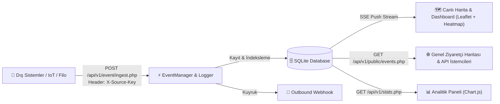

# 📡 Realtime Map Event Grid (RTEG)

[](https://php.net/)
[](https://sqlite.org/)
[](https://leafletjs.com/)
[](https://tailwindcss.com/)
[](https://docker.com)
[](https://opensource.org/licenses/Apache-2.0)

> **High-Performance Spatial Event Ingestion & Realtime Visualization Engine**  
> *Gerçek Zamanlı Coğrafi Olay Toplama, Canlı Akış & Isı Haritası (Heatmap) Motoru*

---

## 🇹🇷 Türkçe Açıklama

### 🎯 Proje Özeti
**Realtime Map Event Grid (RTEG)**; IoT sensörleri, araç takip filoları, teslimat/kurye ağları, güvenlik alarmları ve mobil uygulamalardan gelen coğrafi olayları (Spatial Events) REST API üzerinden toplayan, kaydeden, Server-Sent Events (SSE) ile sıfır gecikmeli yayınlayan ve Leaflet.js / Heatmap ile görselleştiren hafif ve modüler bir platformdur.

Framework bağımlılığı olmadan saf (Vanilla) PHP 8 ve modern JavaScript ile geliştirilmiştir.

### ✨ Temel Özellikler
* **⚡ Sıfır Gecikmeli Canlı Akış (SSE & Smart Polling):** Server-Sent Events ile anlık push bildirimi. Bağlantı kesintilerinde otomatik akıllı Polling fallback.
* **🔥 Dinamik Isı Haritası (Heatmap) & Katmanlar:**
  * 📍 **Pin Modu:** Olay türüne göre renkli ve pulsate animasyonlu pinler.
  * 🔥 **Isı Haritası (Heatmap):** Olay yoğunluğunu gösteren renk gradyanı.
  * ✨ **Karma Mod:** Pinler ve ısı haritasının eşzamanlı gösterimi.
* **🔍 Gelişmiş Coğrafi & Metin Filtreleme:**
  * **Bounding Box:** Sadece haritada görünen alandaki olayları listeleme.
  * **Payload Arama:** JSON payload ve olay ID içinde anlık metin araması.
  * **Kategori & Kaynak:** Olay türü ve API kaynağı bazlı filtreleme.
* **⏱️ Olay Geçmişi Oynatıcı (Time Scrubber / Replay):** Harita üzerinde geçmiş olayları video gibi ileri-geri sarma, 1x-10x hızlarında oynatma ve zaman damgasına göre dinamik canlandırma.
* **🎲 Dahili Olay Simülatörü:** Tek tıkla gerçekçi koordinatlara sahip araç hareketi, sensör alarmı ve teslimat olayları üreten test motoru.
* **📊 Sistem Analitiği & Grafikler:** Chart.js ile 24 saatlik saatlik olay trendi, tür dağılım donut grafiği ve en aktif kaynaklar tablosu.
* **🔑 API Kaynak Yönetimi:** Dış sistemler için `X-Source-Key` üretme, duraklatma ve yönetme.
* **🔔 Outbound Webhook:** Gelen olayları HMAC-SHA256 imzasıyla harici partner URL'lerine POST eden kuyruk altyapısı.
* **💎 Ultra Modern Dark UI:** Glassmorphism, Inter/Outfit tipografisi, syntax-highlighted JSON modalı ve sesli bildirimler.

---

## 🇬🇧 English Description

### 🎯 Overview
**Realtime Map Event Grid (RTEG)** is a lightweight, high-performance spatial event processing and visualization platform. It ingests geo-located events from external IoT sensors, fleet trackers, courier dispatchers, and mobile clients via REST API, stores them in SQLite, streams them with Server-Sent Events (SSE), and renders them on an interactive dark-themed Leaflet map.

### ✨ Key Highlights
* **⚡ Zero-Latency Streaming:** Native Server-Sent Events (SSE) push channel with automatic 3s polling fallback.
* **🔥 Multi-Layer Visualization:** Switch seamlessly between Pins, Heatmap Density layer, and Combined mode.
* **🔍 Dynamic Spatial Filtering:** Bounding-box (visible map viewport), JSON payload full-text search, and multi-criteria filters.
* **⏱️ Historical Time Scrubber & Map Replay:** Scrub, rewind, and replay events across a dynamic timeline with variable playback speeds (1x to 10x).
* **🎲 Built-in Event Simulator:** On-demand generator for realistic vehicle movements, sensor alerts, and deliveries.
* **📊 Analytics Dashboard:** 24-hour hourly trend line charts and category doughnut distributions via Chart.js.
* **🔑 API Key & Source Management:** Dynamic `X-Source-Key` generation and status toggles.
* **🔔 Outbound Webhooks:** Background queue dispatcher with HMAC-SHA256 signatures.

---

## 🏗️ Mimari & Veri Akışı / Architecture



---

## 🚀 Hızlı Kurulum / Quick Start

### Seçenek A: 🐳 Docker ile Tek Komutla Çalıştırma (Önerilen)
```bash
git clone https://github.com/adacreativeco/realtime-map-event-grid.git
cd realtime-map-event-grid

# Tek komutla başlatın
docker compose up -d
```
Sistem anında `http://localhost:8081` üzerinde hazır olacaktır!

---

### Seçenek B: PHP Built-in Server ile Çalıştırma
```bash
git clone https://github.com/adacreativeco/realtime-map-event-grid.git
cd realtime-map-event-grid

# Yapılandırmayı kopyalayın
cp config/credentials.example.php config/credentials.php

# Veritabanını başlatın
php database/init.php

# Sunucuyu başlatın
php -S localhost:8081 -t public
```

---

## 🔐 Varsayılan Giriş Bilgileri / Default Credentials

| Alan / Field | Değer / Value |
|---|---|
| **URL** | `http://localhost:8081/login.php` |
| **Kullanıcı Adı / Username** | `admin` |
| **Şifre / Password** | `password123` |

*(Canlı ortamda `config/credentials.php` üzerinden şifreyi değiştirmeniz önerilir.)*

---

## 📡 API Uç Noktaları / API Endpoints

### 1. Olay Girişi (Event Ingest)
* **Endpoint:** `POST /api/v1/event/ingest.php`
* **Headers:** `Content-Type: application/json`, `X-Source-Key: <YOUR_API_KEY>`

```bash
curl -X POST http://localhost:8081/api/v1/event/ingest.php \
  -H "Content-Type: application/json" \
  -H "X-Source-Key: test_key" \
  -d '{
    "type": "vehicle_movement",
    "lat": 41.0151,
    "lon": 28.9795,
    "timestamp": 1733872741,
    "payload": {
      "vehicle_id": "34-ABC-789",
      "speed_kmh": 65,
      "status": "in_transit"
    }
  }'
```

### 2. Canlı Akış (Server-Sent Events)
* **Endpoint:** `GET /api/v1/events/stream.php`

```javascript
const stream = new EventSource('/api/v1/events/stream.php');
stream.addEventListener('event', (e) => {
    const event = JSON.parse(e.data);
    console.log('Canlı Olay:', event);
});
```

### 3. Genel Okuma API (Public Read)
* **Endpoint:** `GET /api/v1/public/events.php?limit=50&type=vehicle_movement`

---

## 🗂️ Dizin Yapısı / Directory Structure

```text
realtime-map-event-grid/
├── config/              # Ayarlar (settings.php, credentials.php)
├── database/            # SQLite veritabanı & init scripti
├── public/              # Web Root (Sunulan sayfalar & API'ler)
│   ├── api/v1/          # REST API & SSE endpointleri (ingest, stream, events, stats)
│   ├── assets/          # CSS stilleri & Vanilla JS harita motorları
│   ├── index.php        # Yönetici Harita Paneli (Dashboard)
│   ├── stats.php        # Analitik & İstatistikler
│   ├── sources.php      # API Anahtar Yönetimi
│   ├── public_map.php   # Genel Ziyaretçi Haritası
│   └── api_docs.php     # İnteraktif API Dokümantasyonu
├── scripts/             # Cron / Bakım scriptleri (cleanup.php, dispatch_webhooks.php)
├── src/                 # Çekirdek Sınıflar (Auth, Database, EventManager, Logger, Webhook)
├── test_ingest.php      # Test veri gönderim scripti
├── LICENSE              # MIT Lisansı
└── README.md            # Proje Dokümantasyonu
```

---

## 📄 Lisans / License
Bu proje [Apache 2.0 Lisansı](LICENSE) altında lisanslanmıştır.
