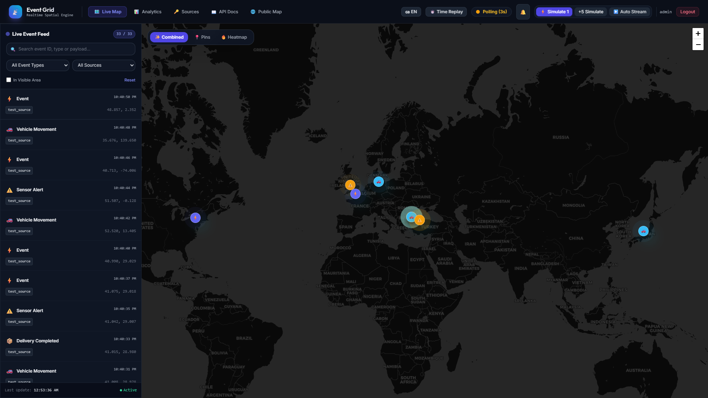
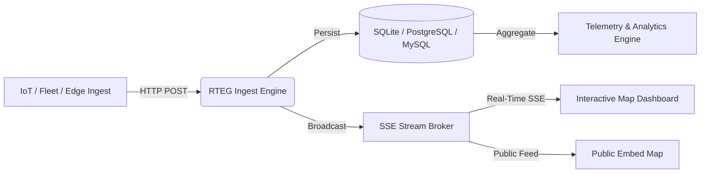
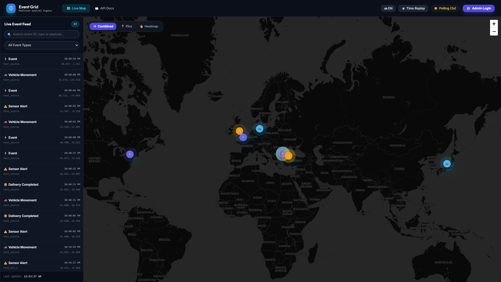
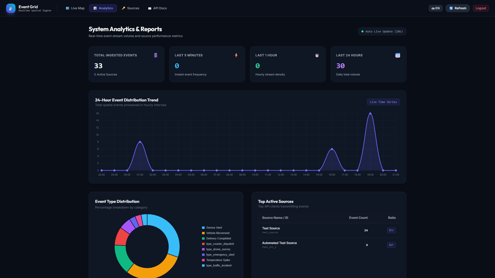
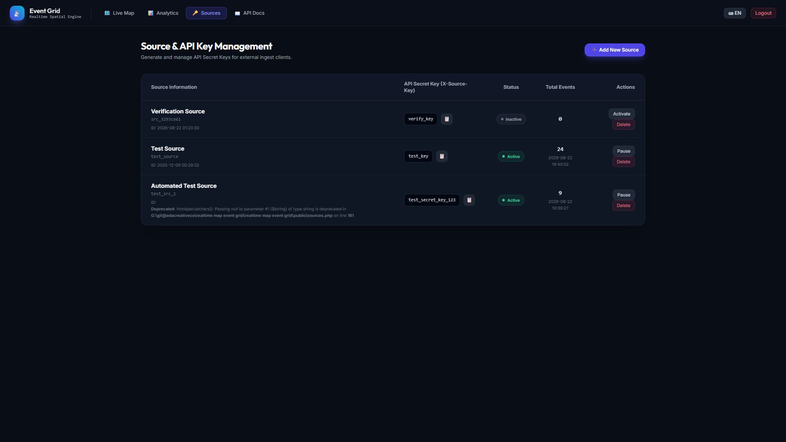
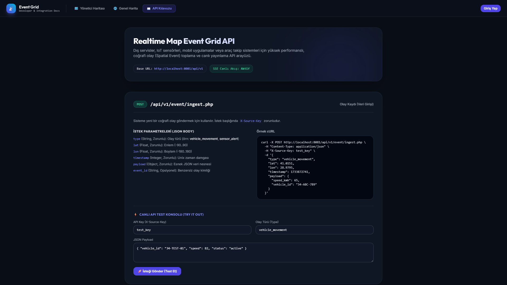

# 📡 Realtime Map Event Grid (RTEG)

<p align="center">
  <a href="README.md">🇬🇧 English</a> •
  <a href="README.tr.md">🇹🇷 Türkçe</a>
</p>

---

<div align="center">

[](https://php.net/)
[](https://sqlite.org/)
[](https://postgresql.org/)
[](https://mysql.com/)
[](https://docker.com/)
[](LICENSE)
[](tests/test_rteg.php)
[](https://github.com/adacreativeco/realtime-map-event-grid/stargazers)

</div>

**Realtime Map Event Grid (RTEG)** is a high-throughput, geospatial event streaming and visualization engine. It provides high-frequency HTTP ingestion, sub-second Server-Sent Events (SSE) broadcasting, spatial boundary filtering, interactive Leaflet/Heatmap layers, and source key governance.

<p align="center">
  
</p>

---

## 🌟 Visual Showcase & Key Modules



### 1. 🗺️ Live Event Stream & Spatial Dashboard
- Real-time SSE live feed with clustering, custom category icons, and auto-centering.
- Multi-layer visualization supporting **Combined Markers, Isolated Pins, and Density Heatmaps**.
- Instant payload inspection and temporal replay controls.

<p align="center">
  
</p>

### 2. 📊 Stream Telemetry & Spatial Analytics
- Real-time 24-hour event distribution chart (Chart.js time series).
- Dynamic event category breakdown (Vehicle Movement, Sensor Alert, Delivery, Emergency, Drone Survey).
- Top transmitting API sources and throughput ratios.

<p align="center">
  
</p>

### 3. 🔑 Source & API Key Governance
- Multi-client API key generation with granular active/paused state controls.
- Automatic rate-limiting and source event accounting.

<p align="center">
  
</p>

### 4. 📖 Interactive API Documentation
- Full REST API specification with sample `curl`, JavaScript, and Python snippets.

<p align="center">
  
</p>

---

## 🚀 Quick Start

### 1. Requirements
- PHP 8.0+ (with `pdo`, `pdo_sqlite`, `pdo_pgsql`, or `pdo_mysql`)
- Web server (Nginx, Apache, or PHP Built-in Server)

### 2. Installation & Run
```bash
# Clone the repository
git clone https://github.com/adacreativeco/realtime-map-event-grid.git
cd realtime-map-event-grid

# Initialize the database
php database/init.php

# Start development server
php -S 127.0.0.1:8080 -t public
```

### 3. Run Automated Tests
```bash
php tests/test_rteg.php
```

---

## 📡 Ingesting Events via API

```bash
curl -X POST http://localhost:8080/api/v1/event/ingest.php \
  -H "Content-Type: application/json" \
  -H "X-Source-Key: test_key" \
  -d '{
    "type": "vehicle_movement",
    "lat": 41.0082,
    "lon": 28.9784,
    "payload": {
      "vehicle_id": "FLEET-104",
      "speed_kmh": 62,
      "status": "in_transit"
    }
  }'
```

---

## 📄 License
Licensed under the Apache License 2.0. Developed with 🧠 by [ADA Creative Co.](https://github.com/adacreativeco).
