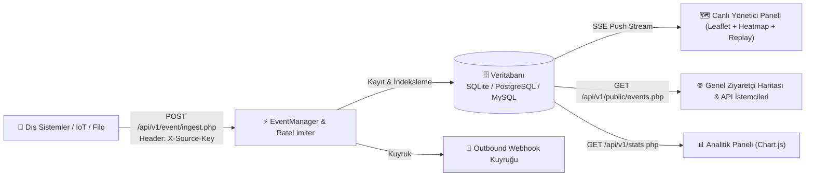

# 📡 Realtime Map Event Grid (RTEG)

<p align="center">
  <a href="https://php.net/"></a>
  <a href="https://www.postgresql.org/"></a>
  <a href="https://www.mysql.com/"></a>
  <a href="https://www.sqlite.org/"></a>
  <a href="https://docker.com"></a>
  <a href="LICENSE"></a>
</p>

<p align="center">
  <b>Gerçek Zamanlı Coğrafi Olay Toplama, Canlı Akış & Isı Haritası (Heatmap) Motoru</b><br>
  <i>Server-Sent Events (SSE), Isı Haritası katmanları ve zaman çizelgesi oynatıcısına sahip ultra hafif saf PHP 8 çekirdeği.</i>
</p>

<p align="center">
  <a href="README.md"><b>English 🇬🇧</b></a> •
  <a href="README.tr.md"><b>Türkçe 🇹🇷</b></a>
</p>

---

## 🎯 Proje Özeti

**Realtime Map Event Grid (RTEG)**; IoT sensörleri, araç takip filoları, teslimat/kurye ağları, güvenlik alarmları ve mobil uygulamalardan gelen coğrafi olayları (Spatial Events) REST API üzerinden toplayan, kaydeden, Server-Sent Events (SSE) ile sıfır gecikmeli yayınlayan ve Leaflet.js / Heatmap ile görselleştiren hafif ve modüler bir platformdur.

Framework bağımlılığı olmadan saf (Vanilla) PHP 8 ve modern JavaScript ile geliştirilmiş olup, kurumsal seviyede hız ve sıfır yük sunar.

---

## ✨ Temel Özellikler

* **⚡ Sıfır Gecikmeli Canlı Akış (SSE & Smart Polling):** Server-Sent Events ile anlık push bildirimi. Bağlantı kesintilerinde otomatik 3 saniyelik akıllı Polling fallback.
* **🔥 Dinamik Isı Haritası (Heatmap) & Katman Modları:**
  * 📍 **Pin Modu:** Olay türüne göre renkli ve yanıp sönen (pulse) animasyonlu pinler.
  * 🔥 **Isı Haritası (Heatmap):** Olay yoğunluğunu gösteren anlık renk gradyanı.
  * ✨ **Karma Mod:** Pinler ve ısı haritasının eşzamanlı gösterimi.
* **⏱️ Olay Geçmişi Oynatıcı (Time Scrubber / Replay):** Harita üzerinde geçmiş olayları video gibi ileri-geri sarma, 1x, 2x, 5x, 10x hızlarında oynatma ve zaman damgasına göre dinamik canlandırma.
* **🗄️ Çoklu Veritabanı Mimarisi:** Tek bir ayarla **SQLite** (sıfır kurulumlu dosya DB), **PostgreSQL / PostGIS** (kurumsal coğrafi sorgular) veya **MySQL / MariaDB** üzerinde çalışma.
* **🚦 Token Bucket Hız Sınırı (Rate Limiting):** `X-RateLimit-Limit`, `X-RateLimit-Remaining`, `X-RateLimit-Reset` ve `Retry-After` başlıkları üzerinden kaynak başına istek sınırlaması (HTTP 429 koruması).
* **🔍 Gelişmiş Coğrafi & Metin Filtreleme:**
  * **Bounding Box:** Sadece haritada görünen alandaki olayları listeleme.
  * **Payload Arama:** JSON payload ve olay ID içinde anlık metin araması.
  * **Kategori & Kaynak:** Olay türü ve API kaynağı bazlı filtreleme.
* **🎲 Dahili Olay Simülatörü:** Tek tıkla gerçekçi koordinatlara sahip araç hareketi, sensör alarmı ve teslimat olayları üreten test motoru.
* **📊 Sistem Analitiği & Grafikler (Chart.js):** 24 saatlik saatlik olay trendi, tür dağılım donut grafiği ve en aktif kaynaklar tablosu.
* **🔑 API Kaynak Yönetimi:** Dış sistemler için `X-Source-Key` üretme, duraklatma ve yönetme.
* **🔔 Outbound Webhook:** Gelen olayları HMAC-SHA256 imzasıyla harici partner URL'lerine POST eden kuyruk altyapısı.
* **🌐 Tam Çift Dil Desteği (i18n):** Sayfa yenilemeden tek tıkla 🇹🇷 TR / 🇬🇧 EN dil değişimi.

---

## 🏗️ Mimari & Veri Akışı



---

## 🚀 Hızlı Kurulum

### Seçenek A: 🐳 Docker ile Tek Komutla Çalıştırma (Önerilen)

```bash
git clone https://github.com/adacreativeco/realtime-map-event-grid.git
cd realtime-map-event-grid

# Container'ı arka planda başlatın
docker compose up -d
```
Sistem anında `http://localhost:8081` üzerinde hazır olacaktır!

---

### Seçenek B: PHP Built-in Server ile Çalıştırma

```bash
git clone https://github.com/adacreativeco/realtime-map-event-grid.git
cd realtime-map-event-grid

# Yapılandırmayı şablondan kopyalayın
cp config/credentials.example.php config/credentials.php

# Veritabanı tablolarını başlatın
php database/init.php

# Geliştirme sunucusunu başlatın
php -S localhost:8081 -t public
```

---

## 🔐 Varsayılan Giriş Bilgileri

| Alan | Değer |
|---|---|
| **Giriş URL'i** | `http://localhost:8081/login.php` |
| **Kullanıcı Adı** | `admin` |
| **Şifre** | `password123` |

*(Canlı ortamda `config/credentials.php` üzerinden şifreyi `password_hash()` ile değiştirmeniz önerilir.)*

---

## 📡 API Uç Noktaları

### 1. Olay Girişi (Event Ingest)
* **Endpoint:** `POST /api/v1/event/ingest.php`
* **Headers:** `Content-Type: application/json`, `X-Source-Key: <API_ANAHTARI>`

```bash
curl -X POST http://localhost:8081/api/v1/event/ingest.php \
  -H "Content-Type: application/json" \
  -H "X-Source-Key: test_key" \
  -d '{
    "type": "vehicle_movement",
    "lat": 41.0151,
    "lon": 28.9795,
    "timestamp": 1733872741,
    "payload": {
      "vehicle_id": "34-ABC-789",
      "speed_kmh": 65,
      "status": "in_transit"
    }
  }'
```

**Başarılı Yanıt (`201 Created`):**
```json
{
  "status": "success",
  "event_id": "evt_64f1a2b3c4d5e"
}
```

### 2. Canlı Akış (Server-Sent Events)
* **Endpoint:** `GET /api/v1/events/stream.php`

```javascript
const stream = new EventSource('http://localhost:8081/api/v1/events/stream.php');
stream.addEventListener('event', (e) => {
    const event = JSON.parse(e.data);
    console.log('Canlı Olay Geldi:', event);
});
```

### 3. Genel Okuma API (Public Read)
* **Endpoint:** `GET /api/v1/public/events.php?limit=50&type=vehicle_movement&search=34-ABC`

---

## 🗂️ Dizin Yapısı

```text
realtime-map-event-grid/
├── config/              # Ayarlar (settings.php, credentials.php)
├── database/            # Veritabanı tabloları & init scripti
├── public/              # Web Root (Sayfalar & REST API)
│   ├── api/v1/          # REST API (ingest, stream, events, stats, simulator)
│   ├── assets/          # CSS stilleri, i18n sözlüğü, Leaflet & Replay JS motorları
│   ├── index.php        # Yönetici Harita Paneli (Time Scrubber ile)
│   ├── stats.php        # Sistem Analitiği & Raporlar
│   ├── sources.php      # API Anahtar Yönetimi
│   ├── public_map.php   # Genel Ziyaretçi Haritası
│   └── api_docs.php     # İnteraktif API Dokümantasyonu
├── scripts/             # Cron / Bakım scriptleri (cleanup.php, dispatch_webhooks.php)
├── src/                 # Çekirdek Sınıflar (Auth, Database, EventManager, Logger, RateLimiter, Webhook)
├── Dockerfile           # Alpine PHP 8.2 Production Container
├── docker-compose.yml   # Docker Compose orkestrasyon dosyası
├── docker-entrypoint.sh # Container başlatıcı script
├── LICENSE              # Apache 2.0 Lisansı
├── README.md            # İngilizce Dokümantasyon
└── README.tr.md         # Türkçe Dokümantasyon
```

---

## 📄 Lisans
Bu proje [Apache 2.0 Lisansı](LICENSE) altında lisanslanmıştır.
Telif Hakkı 2026 **ADA Creative Co.**
