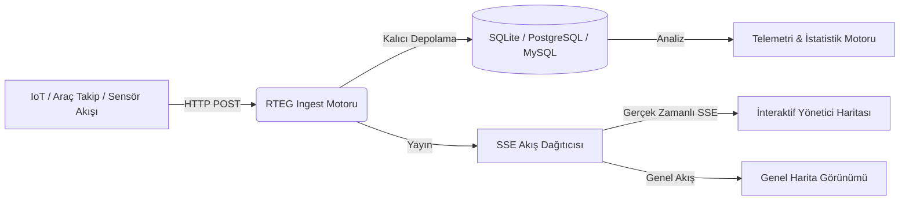

# 📡 Realtime Map Event Grid (RTEG)

<p align="center">
  <a href="README.md">🇬🇧 English</a> •
  <a href="README.tr.md">🇹🇷 Türkçe</a>
</p>

---

<div align="center">

[](https://php.net/)
[](https://sqlite.org/)
[](https://postgresql.org/)
[](https://mysql.com/)
[](https://docker.com/)
[](LICENSE)
[](tests/test_rteg.php)
[](https://github.com/adacreativeco/realtime-map-event-grid/stargazers)

</div>

**Realtime Map Event Grid (RTEG)**, yüksek hacimli mekânsal (geospatial) olay akışlarını toplayan, Server-Sent Events (SSE) ile anlık olarak harita üzerinde görselleştiren ve yöneten yüksek performanslı bir gerçek zamanlı olay motorudur.

<p align="center">
  
</p>

---

## 🌟 Öne Çıkan Modüller & Görseller



### 1. 🗺️ Canlı Olay Haritası & Kontrol Paneli
* Kümeleme (Clustering), kategori bazlı dinamik ikonlar ve anlık olay listesi.
* **Kombine İşaretçiler, Nokta Pinler ve Isı Haritası (Heatmap)** katman desteği.
* Olay detay penceresi, zaman tüneli (Time Replay) ve harita içi arama.

<p align="center">
  
</p>

### 2. 📊 Akış Telemetrisi & Mekânsal Analitik
* 24 saatlik olay dağılım trendi grafiği (Chart.js zaman serisi).
* Olay kategorisi dağılım oranları (Araç Hareketi, Sensör Uyarısı, Teslimat, Acil Durum vb.).
* En aktif kaynak istemcileri ve iletim oranları.

<p align="center">
  
</p>

### 3. 🔑 Kaynak & API Anahtarı Yönetimi
* Dış istemciler için anlık API Secret Key üretimi, duraklatma ve aktif etme kontrolleri.
* Hız sınırı (Rate Limiting) ve kaynak bazlı olay sayaçları.

<p align="center">
  
</p>

### 4. 📖 İnteraktif API Dokümantasyonu
* Örnek `curl`, JavaScript ve Python kod parçacıklarıyla eksiksiz REST API kılavuzu.

<p align="center">
  
</p>

---

## 🚀 Hızlı Başlangıç

### 1. Gereksinimler
* PHP 8.0+ (`pdo`, `pdo_sqlite`, `pdo_pgsql` veya `pdo_mysql` eklentileri)
* Web sunucusu (Nginx, Apache veya PHP Yerel Sunucusu)

### 2. Kurulum ve Çalıştırma
```bash
# Depoyu klonlayın
git clone https://github.com/adacreativeco/realtime-map-event-grid.git
cd realtime-map-event-grid

# Veritabanını başlatın
php database/init.php

# Geliştirme sunucusunu başlatın
php -S 127.0.0.1:8080 -t public
```

### 3. Otomatik Testleri Çalıştırma
```bash
php tests/test_rteg.php
```

---

## 📄 Lisans
Apache License 2.0 ile lisanslanmıştır. [ADA Creative Co.](https://github.com/adacreativeco) tarafından geliştirilmiştir.
