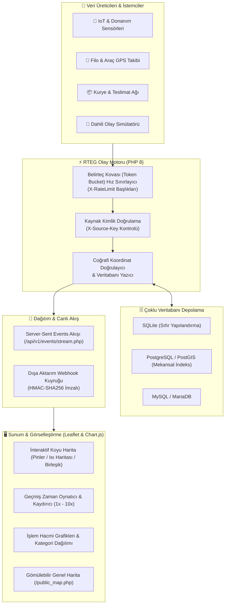

# 📡 Realtime Map Event Grid (RTEG)

<div align="center">

[](https://php.net/)
[](https://sqlite.org/)
[](https://postgresql.org/)
[](https://mysql.com/)
[](https://docker.com/)
[](LICENSE)
[](tests/test_rteg.php)
[](https://github.com/adacreativeco/realtime-map-event-grid/stargazers)
[](https://github.com/adacreativeco/realtime-map-event-grid/releases)

<br/>

**Yüksek Performanslı Coğrafi Olay Toplama, Gerçek Zamanlı Akış & Isı Haritası (Heatmap) Görselleştirme Motoru.**

[🇹🇷 Türkçe Dokümantasyon](README.tr.md) • [🇺🇸 English Documentation](README.md) • [📖 Vaka Analizi](https://adacreative.co/vaka-analizleri/realtime-map-event-grid)

</div>

---

**Realtime Map Event Grid (RTEG)**, harici IoT sensörlerinden, araç filolarından, kurye ağlarından ve mobil istemcilerden gelen konum etiketli olayları REST API üzerinden yüksek verimle toplayan, SQLite, PostgreSQL/PostGIS veya MySQL veritabanlarında saklayan, **Server-Sent Events (SSE)** ile gerçek zamanlı yayınlayan ve Leaflet ısı haritalarıyla koyu temalı harita üzerinde görselleştiren hafif ve güçlü bir platformdur.

Saf **PHP 8** ve modern JavaScript kullanılarak **sıfır harici kütüphane/framework yüküyle** kurumsal hız ve güvenlik sağlayacak şekilde geliştirilmiştir.

---

## 🏗️ Sistem Mimarisi



---

## 🚀 Öne Çıkan Yetenekler

### 1. ⚡ Sıfır Gecikmeli Canlı Akış (SSE)
- WebSocket el sıkışma karmaşası olmadan standart **Server-Sent Events (SSE)** protokolü üzerinden olayları milisaniyeler içinde tarayıcıya iletir.
- Eski tarayıcılar için 3 saniyelik otomatik akıllı yoklama (polling) desteği.

### 2. 🔥 Dinamik Isı Haritası & Katman Modları
- 📍 **Pin Modu:** Kategoriye göre renk kodlu ve parlayan animasyonlu harita işaretçileri.
- 🔥 **Isı Haritası Modu:** Mekansal yoğunluk gradyanıyla olay kümelenmelerini ve sıcak noktaları gösterir.
- ✨ **Birleşik Mod:** Hem işaretçileri hem de ısı haritasını eşzamanlı görüntüler.

### 3. ⏱️ Geçmiş Zaman Kaydırıcı & Harita Oynatıcı
- Geçmiş olayları zaman tünelinde geri sarıp farklı hızlarda (`1x`, `2x`, `5x`, `10x`) animasyonlu olarak yeniden oynatma kontrolcüsü.

### 4. 🗄️ Çoklu Veritabanı Mimarisi
- **SQLite:** Sıfır kurulumlu yerel dosya veritabanı.
- **PostgreSQL / PostGIS:** Kurumsal mekansal indeksleme (`idx_events_coords`, `idx_events_ts`).
- **MySQL / MariaDB:** Yüksek hacimli ilişkisel depolama.

### 5. 🚦 Belirteç Kovası (Token Bucket) Hız Sınırlama
- İstemci bazında hız kısıtlaması uygulayarak DDoS ve aşırı yüklenmeyi engeller (`X-RateLimit-Limit`, `X-RateLimit-Remaining`, `Retry-After` HTTP 429 koruması).

### 6. 🔍 Çok Boyutlu Mekansal Filtreleme
- **Sınırlayıcı Kutu (`bounds`):** Yalnızca haritanın görünür alanındaki olayları getirir.
- **JSON Veri Arama:** Olay gövdesi (payload) içinde anında tam metin arama.
- **Kategori & Kaynak Filtresi:** Filo, sensör uyarısı veya teslimat türlerine göre anlık süzme.

### 7. 🔔 Dışa Aktarım Webhookları
- Arka plan kuyruk yöneticisi (`scripts/dispatch_webhooks.php`) ile olayları üçüncü parti sistemlere **HMAC-SHA256** imzasıyla iletir.

---

## 📡 API Uç Noktaları

| Uç Nokta | Metot | Kimlik Doğrulama | Açıklama |
|---|---|---|---|
| `/api/v1/event/ingest.php` | `POST` | `X-Source-Key` | Enlem, boylam, zaman damgası ve veri içeren yeni mekansal olay kaydeder. |
| `/api/v1/events/stream.php` | `GET` | Yok | Server-Sent Events (SSE) gerçek zamanlı canlı yayın akışı. |
| `/api/v1/events.php` | `GET` | İsteğe Bağlı | Sınırlayıcı kutu, kategori, limit ve zamana göre olayları sorgular. |
| `/api/v1/stats.php` | `GET` | İsteğe Bağlı | 24 saatlik hacim, kategori dağılımı ve işlem metriklerini döner. |
| `/api/v1/simulator.php` | `POST` | Yönetici Oturumu | Hareket eden araç GPS'leri, kuryeler ve sensör alarmları simüle eder. |

### 📝 Örnek Olay Gönderimi (cURL)

```bash
curl -X POST http://localhost:8081/api/v1/event/ingest.php \
  -H "Content-Type: application/json" \
  -H "X-Source-Key: test_key" \
  -d '{
    "type": "vehicle_movement",
    "lat": 41.0082,
    "lon": 28.9784,
    "timestamp": 1724250000,
    "payload": {
      "vehicle_id": "CAR-042",
      "speed_kmh": 72.4,
      "fuel_level": 84
    }
  }'
```

---

## 🛠️ Hızlı Başlangıç

### Seçenek A: Docker Compose (Önerilen)
```bash
git clone https://github.com/adacreativeco/realtime-map-event-grid.git
cd realtime-map-event-grid
docker-compose up -d
```
Tarayıcınızda [http://localhost:8081](http://localhost:8081) adresini açın. (Varsayılan giriş: `admin` / `admin123`).

### Seçenek B: Yerel PHP Sunucusu
```bash
# 1. Veritabanını Başlatın
php database/init.php

# 2. Otomatik Birim Testleri Çalıştırın
php tests/test_rteg.php

# 3. Yerel Sunucuyu Başlatın
php -S 0.0.0.0:8081 -t public/
```
Tarayıcınızda [http://localhost:8081](http://localhost:8081) adresini açın.

---

## 📂 Proje Yapısı

```
realtime-map-event-grid/
├── config/
│   ├── credentials.php             # Veritabanı ve API kaynak anahtarları
│   └── settings.php                # Genel ayarlar ve hız sınırları
├── database/
│   ├── events.db                   # Varsayılan SQLite veritabanı
│   └── init.php                    # Çoklu veritabanı şema göç betiği
├── public/                         # Web kök dizini
│   ├── index.php                   # Ana kontrol paneli (Leaflet harita & canlı akış)
│   ├── public_map.php              # Dışa gömülebilir genel harita
│   ├── stats.php                   # Analitik grafikleri (Chart.js)
│   ├── sources.php                 # API kaynak anahtarı yönetim paneli
│   ├── api_docs.php                # İnteraktif API dokümantasyonu
│   ├── api/v1/                     # REST API uç noktaları (ingest, stream, stats, simulator)
│   └── assets/                     # CSS stilleri & JavaScript kontrolcüleri
├── src/                            # Çekirdek PHP sınıfları
│   ├── Auth.php                    # Oturum ve güvenlik yönetimi
│   ├── Database.php                # PDO bağlantı havuzu (SQLite/PostgreSQL/MySQL)
│   ├── EventManager.php            # Olay doğrulama ve mekansal sorgulama
│   ├── RateLimiter.php             # Belirteç kovası hız sınırlayıcı motor
│   ├── Webhook.php                 # Webhook kuyruğu ve HMAC imzalama
│   └── Logger.php                  # Erişim ve hata kayıtları
├── scripts/
│   ├── cleanup.php                 # Eski veri temizleme cron betiği
│   └── dispatch_webhooks.php       # Arka plan webhook kuyruk dağıtıcısı
├── tests/
│   └── test_rteg.php               # Otomatik test paketi (19 birim test)
├── Dockerfile                      # Üretim PHP-Apache imajı
└── docker-compose.yml              # Konteyner yapılandırması
```

---

## 📄 Lisans

Apache 2.0 Lisansı ile dağıtılmaktadır. Detaylar için [LICENSE](LICENSE) dosyasına bakabilirsiniz.

---

<div align="center">
📡 <a href="https://github.com/adacreativeco">ADA Creative Co.</a> tarafından geliştirilmiştir.
</div>
